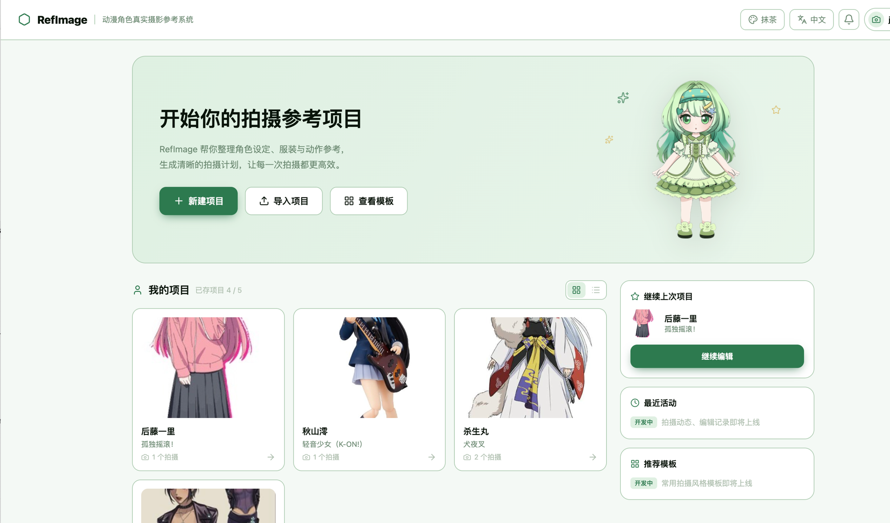

# RefImage — 动漫角色真实摄影参考系统

**[English](README.md) | [中文](README.zh.md)**

上传一张动漫/游戏角色的参考图，RefImage 帮你把这次 cosplay 拍摄从"要拍谁"一路规划到"具体每一张怎么拍"——角色资料自动建档、拍摄计划边聊边填、参考例图 AI 生成、拍摄指南和拍摄手册一键导出。



---

## 快速启动

```bash
cp .env.example .env
# 填入 OPENAI_API_KEY（生成/识图/对话都会用到）

docker compose up --build
```

打开 `http://localhost:3001`，用你的邀请 Token 登录即可。

---

## 完整流程

### 1. 新建项目

首页点「新建项目」，上传角色参考图（官方图、截图、设定图都行）。AI 会看图猜角色是谁，报出角色名和作品名请你确认——猜错了直接告诉它正确的角色名就行。确认后 AI 自动查资料，把角色的性格、经历、名场面整理成档案。

### 2. 项目工作区

进入项目后是三个面板：

- **设定** — 角色资料（性格/经历/名场面）、头像立绘、服装道具清单，都可以手动编辑或让 AI 帮你补充。
- **拍摄计划** — 分镜（shot）网格，每个分镜是一张要拍的具体画面。
- **拍摄总结** — 设备、场地、日程、注意事项，这些会自动从你已经确定的各个分镜汇总上来。

项目页右下角常驻一个萌妹小助手，随时可以跟她聊：拍摄大概什么时候、摄影师定了没、假发服装准备得怎么样、这次拍摄整体想表达什么感觉、对角色的理解——她会边聊边帮你记进对应的面板里，不用你自己去表格里一项项填。想开始构思具体画面时，点她给的「去构思分镜」就能直接跳进新分镜。

### 3. 单个分镜（Shot）

每个分镜有自己的画布和小助手：

- **描述你想要的画面** — 跟她说清楚场景、姿势、表情、氛围，她会追问必要的细节，然后调用 AI 生成参考例图。生成的每一版都会留在画布上，方便对比选择。
- **相机面板** — 需要精确指定景别（特写/近景/半身/全身/远景）、机位（俯视/平视/仰视）、画幅（竖图/横图）时，直接在面板上点选，不用靠聊天描述。
- **参考图引导** — 可以上传姿势草图、背景图、道具图、表情参考图，AI 生成时会照着这些参考走。
- **调整面板** — 对某一版生成结果不满意，可以调整构图、色调、表情强度等参数，重新生成一个变体，原图不会丢。
- **四种拍摄指南** — 动作参考图、表情提示、构图/镜头建议、取景地推荐，生成后可以直接照着现场执行。

### 4. 导出拍摄手册

分镜定稿后可以编译成拍摄手册——单个分镜的拍摄单，或整个项目的完整手册（封面、每张分镜的拍摄单、日程表、备用方案、准备清单），网页里直接看，也可以打印/导出 PDF 带到现场用。

### 5. 项目管理

首页管理你的所有项目：新建、继续编辑、导出/导入项目备份、删除。每位用户最多同时保留 5 个项目。

---

## 界面设置

- **主题配色** — 顶栏可以切换多套配色主题（暗黑/亮色/樱花/抹茶/海洋/琥珀/赛博/书卷）。
- **语言** — 支持中文 / English / 日本語，随时切换。
